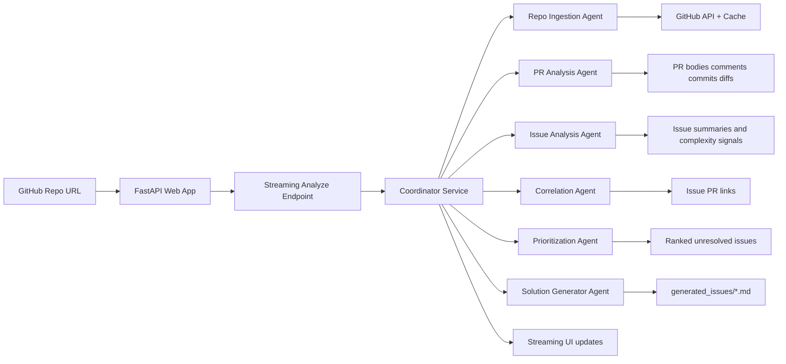
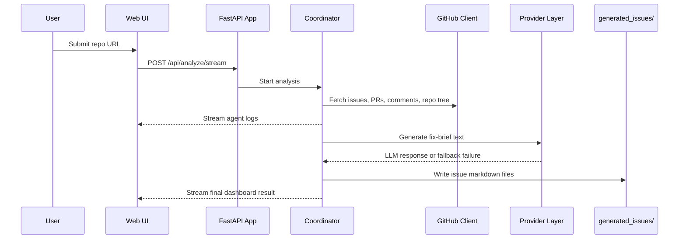

# Open Source Repo Analyser

<p align="center">
  
</p>

<p align="center">
  <a href="#quickstart"></a>
  <a href="#system-map"></a>
  <a href="#what-it-produces"></a>
  <a href="#project-structure">=3.11" /></a>
</p>

<p align="center">
  <strong>Analyze a GitHub repository like a triage team, not a single script.</strong><br/>
  This project ingests open issues and pull requests, links them together with heuristics, prioritizes unresolved work, and generates markdown fix briefs through a streaming FastAPI interface.
</p>

---

## Why This Project Stands Out

Most repo analysis tools stop at counting issues or summarizing pull requests. This one is designed to feel more like an engineering operations assistant:

- It fetches real repository context from GitHub, not just issue titles.
- It links issues to PRs using bodies, comments, commit messages, and fix keywords.
- It scores unresolved issues to surface likely easy wins.
- It generates per-issue markdown briefs with likely files, root-cause hypotheses, and coding guidance.
- It streams agent progress live to the UI, so analysis feels active and inspectable.

## Table of Contents

- [Quickstart](#quickstart)
- [The Experience](#the-experience)
- [System Map](#system-map)
- [How It Thinks](#how-it-thinks)
- [What It Produces](#what-it-produces)
- [Project Structure](#project-structure)
- [Configuration](#configuration)
- [Validation](#validation)
- [Implementation Notes](#implementation-notes)

## Quickstart

```bash
uv sync
cp .env.example .env
uv run python main.py
```

Open `http://127.0.0.1:8000` and paste a repository URL such as:

```text
https://github.com/pallets/flask
```

### Required environment variables

```env
GITHUB_TOKEN=
OPENROUTER_API_KEY=
HUGGINGFACE_API_KEY=
```

### Optional tuning

```env
OPENROUTER_MODEL=deepseek/deepseek-r1-distill-llama-70b
HUGGINGFACE_MODEL=mistralai/Mistral-7B-Instruct-v0.3
GITHUB_CACHE_TTL_SECONDS=600
MAX_MARKDOWN_ISSUES=25
```

<details>
<summary><strong>What happens after you hit Analyze?</strong></summary>

1. The app fetches open issues and all pull requests for the target repo.
2. PRs are scanned for issue references in bodies, comments, and commit messages.
3. Open issues are classified for complexity and easy-fix signals.
4. Unresolved issues are prioritized with deterministic heuristics.
5. The system generates markdown issue briefs in `generated_issues/`.
6. The frontend streams every stage as server-sent events from `/api/analyze/stream`.

</details>

## The Experience

| Input | Engine | Output |
| --- | --- | --- |
| GitHub repository URL | Multi-agent coordinator + GitHub client + heuristic analysis + optional LLM fallback | Live dashboard, issue/PR links, prioritized unresolved issues, generated markdown briefs |

### Designed for

- maintainers triaging large repos
- contributors hunting for approachable issues
- hackathon or internship shortlist workflows
- internal demos of multi-agent orchestration on real OSS data

## System Map



### Agent lineup

| Agent | Responsibility |
| --- | --- |
| `Repo Ingestion Agent` | Fetches repository metadata, open issues, pull requests, comments, and tree context |
| `PR Analysis Agent` | Extracts issue references and changed-file context from PRs |
| `Issue Analysis Agent` | Summarizes issue intent, affected modules, and complexity clues |
| `Correlation Agent` | Decides which issues are linked to which PRs and whether they appear resolved |
| `Prioritization Agent` | Scores unresolved issues for urgency and likely ease-of-fix |
| `Solution Generator Agent` | Produces markdown fix briefs with cautious implementation guidance |
| `Coordinator Agent` | Orchestrates the full pipeline and emits live progress logs |

## How It Thinks

This project is intentionally hybrid. It does not treat LLM output as the single source of truth.

### Heuristics first

- `good first issue`-style labels increase easy-fix confidence
- low discussion volume can indicate a contained change
- references like `Fixes #123` and `Resolves #123` are used for issue/PR correlation
- plain `#123` mentions are also captured
- likely file scope is inferred from repository tree token matching

### LLM second

- OpenRouter is attempted first
- Hugging Face is used as fallback if the first provider fails
- generated text improves the fix brief, but the repository analysis pipeline still stands on deterministic logic

## What It Produces

### Streaming dashboard

The web interface shows:

- repository summary counts
- resolved vs unresolved issue split
- issue-to-PR mappings
- prioritized unresolved issues
- expandable recommendations linked to generated markdown

### Markdown artifacts

Each generated file in `generated_issues/` includes:

- problem summary
- root-cause hypothesis
- suggested fix
- likely files to modify
- code guidance
- confidence score

### Request + artifact flow



## Project Structure

```text
src/repo_analyser/
  agents/workflow.py          coordinator pipeline + optional Google ADK graph
  analysis/issues.py          issue parsing heuristics
  analysis/linking.py         issue/PR linking logic
  analysis/prioritization.py  prioritization and easy-fix scoring
  analysis/solution.py        markdown brief generation + likely-file inference
  providers/                  OpenRouter, HuggingFace, auto-fallback abstraction
  tools/mcp.py                MCP-style tool surface
  cache.py                    file-backed TTL cache
  config.py                   environment-based settings
  github_api.py               async GitHub client with pagination and rate-limit handling
  logging_utils.py            request-scoped logging helpers
  models.py                   shared Pydantic models
  web/app.py                  FastAPI routes, SSE stream, static mounts
  web/templates/index.html    browser UI shell
  web/static/                 frontend logic and styling
main.py                       application entrypoint
tests/                        unit tests for linking and prioritization
```

## Configuration

### Runtime defaults

| Setting | Default |
| --- | --- |
| `host` | `127.0.0.1` |
| `port` | `8000` |
| `github_cache_ttl_seconds` | `600` |
| `max_markdown_issues` | `25` |
| `request_timeout_seconds` | `45.0` |
| `log_level` | `INFO` |

### Current dependencies

The project currently declares:

- `fastapi`
- `google-adk`
- `httpx`
- `jinja2`
- `pydantic-settings`
- `uvicorn`
- `pytest` in the dev group

## Validation

Run tests with:

```bash
uv run pytest
```

Current coverage focuses on:

- PR-to-issue reference parsing
- resolved issue correlation
- easy-fix classification heuristics

## Implementation Notes

<details>
<summary><strong>Google ADK integration</strong></summary>

When `google-adk` is available, [`src/repo_analyser/agents/workflow.py`](src/repo_analyser/agents/workflow.py) can build a `SequentialAgent` graph with specialized sub-agents. The production app still executes through `CoordinatorService`, which keeps the orchestration predictable and easy to stream to the frontend.

</details>

<details>
<summary><strong>MCP-style tools</strong></summary>

The tool layer in [`src/repo_analyser/tools/mcp.py`](src/repo_analyser/tools/mcp.py) exposes operations like `get_repo_data`, `get_pr_diff`, `get_issue_details`, and `link_issue_pr`, giving the architecture a tool-driven shape that maps well onto agent workflows.

</details>

<details>
<summary><strong>GitHub client behavior</strong></summary>

The GitHub client handles:

- repository URL parsing
- paginated issue and PR fetching
- issue comment collection
- PR diff retrieval
- file-tree discovery from the default branch
- basic cache-backed request reuse
- rate-limit detection through GitHub response headers

</details>

<details>
<summary><strong>Generated output lifecycle</strong></summary>

Before each run, the app clears older markdown artifacts from `generated_issues/` so the dashboard reflects the current repository analysis rather than stale results from a previous scan.

</details>

## Roadmap Ideas

- add recorded GitHub API fixtures for integration testing
- persist historical analyses
- support background jobs for very large repositories
- add richer repository health signals beyond issues and PRs
- introduce comparison mode across multiple repositories

---

<p align="center">
  <strong>Built for repository triage that feels alive, inspectable, and contributor-friendly.</strong>
</p>
